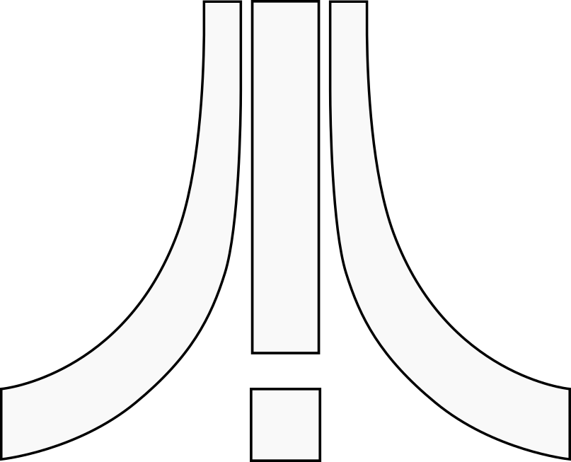

# TOSEMU

An emulated environment to TOS applications.

Copyright (C) 2014-2026 Johan Toverland Thelin <e8johan@gmail.com>

[](https://github.com/e8johan/tosemu/actions/workflows/run-tests.yaml)

Introduction
============



TOSEMU aims to provide an emulated environment for executing TOS applications. 
Instead of emulating a complete TOS-compatible machine, operating system calls 
are intercepted and emulated on the host platform. The end result will be TOS 
applications running as an integrated part of the host system.

This makes it possible to run well behaved TOS programs in a modern setting. 
This includes sharing clipboards, printers, etc. It will never work for games 
and demos.

TOSEMU can be seen as a mix of 68kemu, which allows 68k applications to be 
executed in a TOS environment on another CPU platform, and wine, which lets 
Windows applications execute using a system API translation layer on the CPU 
platform they where meant for. TOSEMU executes 68k applications on non-68k 
CPUs, and provides an OS wrapper layer, translating TOS calls to system calls 
native to the host operating system.

I use LLM technology to speed things along from time to time. Feel free to join
in by adding functionality, reporting bugs or helping out in any other way.

Using
=====

TOSEMU exists as two executables:

- **tosemu** for running TOS programs / loading GEM accessories
- **tosaesd** the AES daemon for providing a common place for GEM accessories 
to exist

The `tosaesd` also shows an icon in the desktop tray where you can launch your 
desktop accessories.

A typical setup starts `tosaesd` when the computer starts, then each program is 
started using `tosemu`, e.g.

```
tosemu GENST2.PRG
```

Caveats
-------

The aim of TOSEMU is to run TOS programs fully integrated into the Linux host 
system. This means that command line programs (e.g. `*.TTP`) run directly 
against the command line console, while AES windows are shown as ordinary 
windows in the host Wayland session. 

As Wayland has a security concept that does not let client programs freely place 
their windows, the GEM menu bar has a tendency to land in the middle of the 
screen. To remedy this, the menu bar has been equiped with a small handle, 
allowing you to move it into place yourself.

As each AES program runs in a session of it's own, it also means that there 
might be multiple menu bars available at the same time. Sort your windows 
accordingly.

Configuration
-------------

You can either configure TOSEMU using environment variables or a settings file. 
There is a default settings file, `~/.tosemu`, or you can pick another file 
using the `-c` command line option. The settings file is an ini-style file. You 
will find an example further down the page.

Environment variables take precedence over what is configured in a file and is 
commonly used when trying things out, or during development. If you want to 
avoid reading even the default settings file, use the `--no-config` option.

The table below summarizes the available options:

| In the file            | In the environment   | What it does
| ---------------------- | -------------------- | ---------------------------- |
| `[screen] mode`        | `TOSEMU_SCREEN`      | Pick the screen mode among `low`, `medium`, `high`, `tt-medium`, `tt-high`, `native-mono`, `native-color`, `display-mono`, and `display-color`. The difference between `native-*` and `display-*` is that display uses all of the screen while native attempts to avoid docks and such areas. |
| `[screen] scale`       | `TOSEMU_SCALE`       | Integer scaling of the graphical contents, doubled vertically for `medium`. |
| `[screen] output`      | `TOSEMU_OUTPUT`      | Which output the native screen modes are calculated from, e.g. `DP-1`. Use `wayland-info` to list your available outputs. |
| `[screen] decorations` | `TOSEMU_DECORATIONS` | Choose between host decorations (e.g. window title bars), `desktop`, or client side decorations, `gem`. |
| `[screen] picture`     | `TOSEMU_PICTURE`     | `hide` (the default) or `keep` full screen windows, e.g. when a program draws its own screen. |
| `[machine] memory`     | `TOSEMU_MEMORY`      | System memory, e.g. `512k`, `1m` or `max`, where max is the maximum memory the memory map can accomodate. |
| `[console] output`     | `TOSEMU_CONSOLE`     | Use `screen` to output the console to the TOS screen, or `terminal` to output it to the host terminal. |
| `[files] base`         | `TOS_BASE_PATH`      | The root of the `C:` drive, as TOS sees it. |
| `[fonts] assign`       | `TOSEMU_FONTS_ASSIGN` | Which `ASSIGN.SYS` to use for the [GDOS emulation](docs/FONTS.md). |
| `[fonts] substitutes`  | `TOSEMU_FONTS_SUBSTITUTES` | Which font substitution file to use for the [GDOS emulation](docs/FONTS.md). |
| `[printer] destination` | `TOSEMU_PRINTER`    | The name of the destination printer. |
| `[printer] paper`      | `TOSEMU_PRINTER_PAPER` | Paper size: `a3`, `a4`, `a5`, `letter` or `legal`. |
| `[printer] resolution` | `TOSEMU_PRINTER_DPI` | The resolution of the printer, e.g. `300`. |
| `[printer] file`       | `TOSEMU_PRINT_FILE`  | The name of a file to print to, e.g. `foo.pdf`. |
| `[printer] command`    | `TOSEMU_PRINT_COMMAND` | The name of the print command, e.g. `lp`. |
| `[midi] device`        | `TOSEMU_MIDI`        | What ALSA device the emulated midi port is directed to, e.g. `hw:1,0,0` (from `aplaymidi -l`) or `seq:20:0` (from `aconnect -l`). This can also be a pair of files, e.g. `file:incoming.bin,send.bin`. |
| `[machine] interrupts` | `TOSEMU_INTERRUPTS`  | Turns on the MFP, timers and 200 Hz clock. Uses more CPU for emulation, but is required by some programs, e.g. Cubase. |
| `[session] socket`     | `TOSEMU_AESD`        | Use if you want to provide a specific socket for `tosaesd`. You can run separate sessions for each instance. No need to set if you only plan on running once instance. |

There are also a set of development options:

| In the file            | In the environment   | What it does
| ---------------------- | -------------------- | ---------------------------- |
| `[input] keys`         | `TOSEMU_KEYS`        | For injecting key presses to a process. |
| `[input] clicks`       | `TOSEMU_CLICKS`      | For injecting mouse events to a process. |
| `[screen] window`      | `TOSEMU_NO_WINDOW`   | Keep all windows in-memory, nothing is shown on the screen. |
| `[debug] screenshot`   | `TOSEMU_SCREENSHOT`  | Takes a path to where screenshots are written. |
| `[debug] trace-input`  | `TOSEMU_TRACE_INPUT` | Traces mouse events, directory reads, and file selector reads. |
| `[debug] trace-paths`  | `TOSEMU_TRACE_PATHS` | Traces paths as they are resolved. Great for debugging `TOS_BASE_PATH`-related issues. |

An example settings file:

```
# Everything is in a section. A remark is a whole line and only a whole
# line: a hash halfway along one is part of the value, because a path or a
# list of clicks may have a hash in it and losing its tail is worse than
# having to put the remark above.

[screen]
mode        = native-color
scale       = 3
window      = yes
decorations = atari
# output = DP-1

[machine]
memory = 4m

[console]
output = screen

[files]
base = /home/me/tos

[midi]
device = hw:1,0,0
```


Building
========

Make sure that the submodules are checked out, either while cloning:

```
git clone --recurse-submodules git@github.com:e8johan/tosemu.git
```

Or in a checked out tree:

```
git submodule update --init
```

Then run make to build the project:

```
make
```

The resulting binaries end up in `bin/`.


Advanced Usage
==============

binfmt
------

TOSEMU takes a single command line argument, the location of a TOS application. 
It is also possible to use TOSEMU with the binfmt support in the Linux kernel. I
 use the following line to enable this:

  `echo ':tos:M::\x60\x1a:\xff\xff:/path/to/binary/tosemu:' | sudo tee /proc/sys/fs/binfmt_misc/register`

This will allow you to execute TOS binaries as if they where native.

The application is handed the environment tosemu was started with, so a
variable an application looks for can be set from the host shell. Lattice C's
compiler for instance finds its header files through `INCLUDE`.

TSR programs
------------

A TSR loads, installs itself into the machine, and stays there so that the next
program can use it. This was where the AUTO folder used to be used.

TOSEMU has the `-r` (or `--resident`) command line option, e.g.:

    tosemu -r MROS/MROS3_31 CUBASE.PRG

In the example above, `MROS3_31` is run before `CUBASE.PRG` and Cubase is run in 
the same machine session as MROS.

Dongles and such
----------------

As some programs require a dongle or other special hardware that requires emulation TOSEMU has the `--dongle` command line option. E.g.

    tosemu -r MROS/MROS3_31 --dongle cubase CUBASE.PRG

By default nothing is plugged in, and the only dongle currently supported is 
`cubase`.


Licensing
=========

TOSEMU is available under a GPLv2 license. Please refer to the source code and 
the COPYING file for further details.

Additional Licenses
-------------------

TOSEMU depends on other components available under other licenses than GPLv2. 
These are listed below:

The contents of the `src/Musashi` subdirectory and `src/m68kconf.h`, derived from 
https://github.com/kstenerud/Musashi, is subject to the following license:

> MUSASHI
> Version 3.4
> 
> A portable Motorola M680x0 processor emulation engine.
> Copyright 1998-2001 Karl Stenerud.  All rights reserved.
> 
> Permission is hereby granted, free of charge, to any person obtaining a copy
> of this software and associated documentation files (the "Software"), to deal
> in the Software without restriction, including without limitation the rights
> to use, copy, modify, merge, publish, distribute, sublicense, and/or sell
> copies of the Software, and to permit persons to whom the Software is
> furnished to do so, subject to the following conditions:
> 
> The above copyright notice and this permission notice shall be included in
> all copies or substantial portions of the Software.

